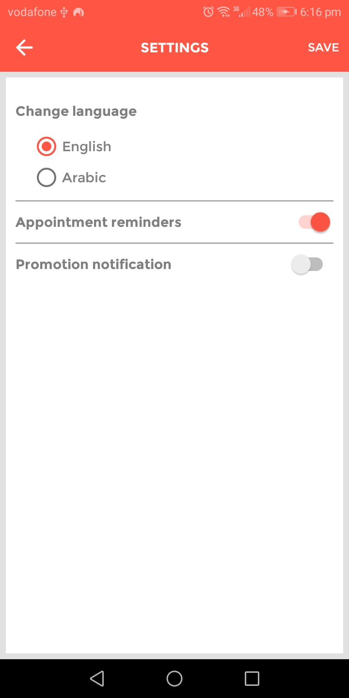

# My DocPoc
</a>

# DocPoc App

- This app is a official app of YackeenSolutions, where i had an internship.
- I was asked to rebuild it as a part of the internship.
- It provides a service of doctor and facilities search in Bahrain. 
- I made some changes in the design and code style.
- This app is written in Java.

# Liberaries used

- [Retrofit](#Retrofit 2.5.0)
- [AutoDimension](#AutoDimension:1.0.4)
- [Facebook](#facebook-login:4.41.0)
- [MVVM design pattern](#lifecycle-viewmodel:2.0.0)
- [Picasso](#picasso:2.71828)

# Screenshots

## Support

- Website at <a href="http://yakensolution.cloudapp.net/" target="_blank">`YackeenSolutions.net`</a>

## Reach out to me at one of the following places!

- Mail me at <a href="emish52020@gmail" target="_blank">`Emish52020@gmail`</a>
